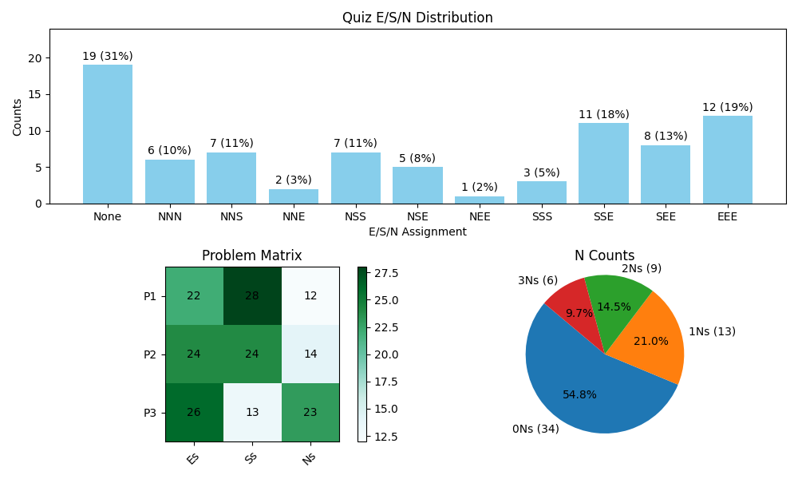

# 12xPaperQuizzes

### Setup

Standard python setup as required. Install python / conda. Create a new conda environment and download requirements found in `requiements.txt` (I didn't double check which ones were strictly necessary - sorry). After all is said and done you should be good to go.

### Useage

First, download .csv report of grades from the gradecope versionset. It should give you a zip which extracts into a directory where every version is a different .csv file (with an overall .csv for the entire versionset). When running the script, you'll have to provide the path to this directory such that the grades can be parsed.

The output you'll get will look something like this:

The charts provided are as follows:
1. Overall distribution of E/S/N profiles among students
2. Problem matrix (to see which problems were most difficult)
3. N-count pie chart (which shows percentages of how many N's students recieved as they are the harshest grade overall).

I found these most useful when considering grading thresholds / overall quiz difficulty, but adding additional plots / swapping plots is rather trivial within the `plot()` function in `quiz_processor.py` if you're familiar with matplotlib.

### Example Commands

Below, provided thresholds (E=8.0, S=5.0) are applied to all problems:
```bash
python3 quiz_processor.py -p quiz_1 -t 8 5
```

Individual thresholds can also be specified per-problem:
```bash
python3 quiz_processor.py -p quiz_1 -t 7 4 8 5 7.5 4
```
Where thresholds are parsed from provided as followed:
1. (E=7.0, S=4.0)
2. (E=8.0, S=5.0)
3. (E=7.5, S=4.0)

When no thresholds are provided, standard exam grading thresholds are applied (E=1.0, S=0.5):
```bash
python3 quiz_processor.py -p quiz_1
```